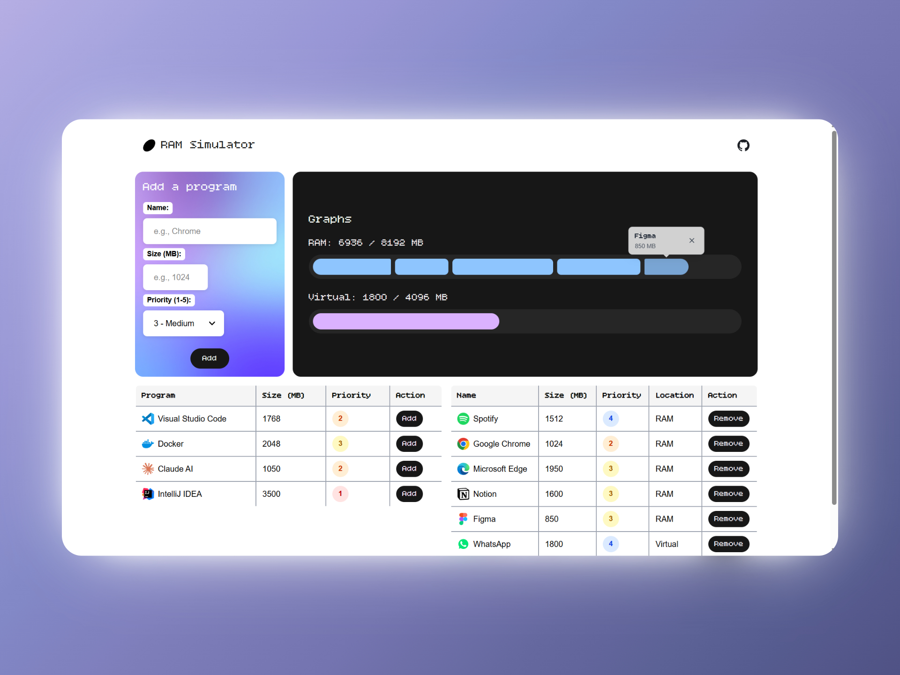
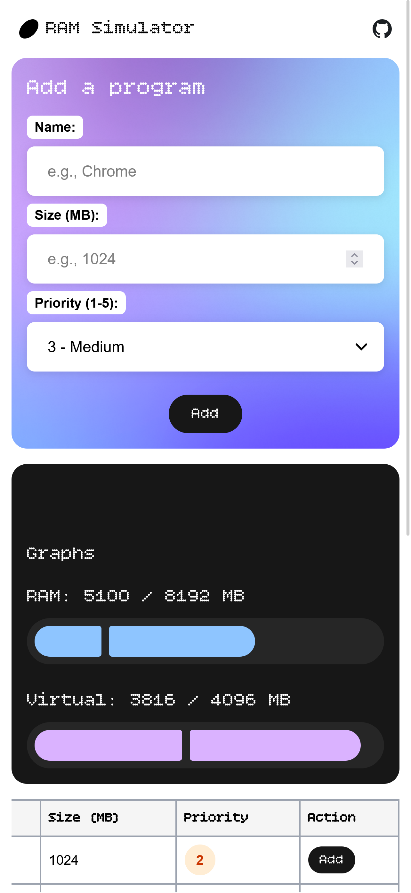

# RAM Simulator

Un simulador interactivo de gestión de memoria RAM y memoria virtual construido con Vue 3, TypeScript y TailwindCSS.

## Vista Previa

### Desktop


### Mobile
<p>
   
</p>

## Características

- **Gestión de Memoria RAM**: Visualiza y gestiona programas en memoria RAM con capacidad de 8GB
- **Memoria Virtual**: Sistema de memoria virtual adicional de 4GB para cuando la RAM está llena
- **Sistema de Prioridades**: Los programas tienen niveles de prioridad (1-5) que determinan su importancia
- **Gestión Inteligente**:
  - Mueve automáticamente programas de menor prioridad a memoria virtual cuando la RAM está llena
  - Cierra programas de baja prioridad si es necesario para ejecutar programas más importantes
- **Visualización en Tiempo Real**: Gráficos interactivos que muestran el uso de RAM y memoria virtual
- **Interfaz Responsiva**: Diseño adaptable para desktop y dispositivos móviles
- **Animaciones Suaves**: Transiciones y animaciones con GSAP

## Tecnologías

- **Vue 3** - Framework progresivo de JavaScript
- **TypeScript** - Tipado estático para JavaScript
- **Vite** - Build tool ultrarrápido
- **TailwindCSS 4** - Framework de CSS utility-first
- **GSAP** - Librería de animaciones de alto rendimiento

## Requisitos Previos

- Node.js (versión 18 o superior)
- npm o yarn

## Instalación

1. Clona el repositorio:
```bash
git clone https://github.com/juliannGabrielDev/ram-simulator.git
cd ram-simulator
```

2. Instala las dependencias:
```bash
npm install
```

3. Inicia el servidor de desarrollo:
```bash
npm run dev
```

4. Abre tu navegador en `http://localhost:5173`

## Scripts Disponibles

- `npm run dev` - Inicia el servidor de desarrollo
- `npm run build` - Construye la aplicación para producción
- `npm run preview` - Previsualiza la build de producción localmente

## Cómo Usar

1. **Agregar un Programa**:
   - Completa el formulario con el nombre, tamaño (en MB) y prioridad del programa
   - Haz clic en "Add" para instalarlo

2. **Ejecutar un Programa**:
   - En la tabla "Installed Programs", haz clic en "Add" junto al programa que deseas ejecutar
   - El simulador intentará agregarlo a RAM o memoria virtual según disponibilidad

3. **Gestión Automática**:
   - Si la RAM está llena, los programas de menor prioridad se mueven automáticamente a memoria virtual
   - Si ambas memorias están llenas, el sistema puede cerrar programas de baja prioridad

4. **Cerrar Programas**:
   - En la tabla "Running Programs", haz clic en "Remove" para cerrar un programa
   - También puedes hacer clic en las X en los gráficos de memoria

## Estructura del Proyecto

```
ram-simulator/
├── public/
│   └── assets/
│       └── img/
│           ├── icons/          # Iconos de programas
│           ├── bg.png          # Imagen de fondo
│           └── oval.svg        # Logo
├── src/
│   ├── assets/                 # Assets estáticos
│   ├── components/             # Componentes Vue
│   │   ├── BaseButton.vue
│   │   ├── InstalledProgramsTable.vue
│   │   ├── RunningProgramsTable.vue
│   │   ├── MemoryGraph.vue
│   │   ├── PageReveal.vue
│   │   └── Popup.vue
│   ├── types/                  # Definiciones de TypeScript
│   ├── App.vue                 # Componente principal
│   └── main.ts                 # Punto de entrada
├── vite.config.ts              # Configuración de Vite
└── package.json
```

## Deployment

Este proyecto está configurado para desplegarse en GitHub Pages:

1. El build se genera automáticamente con GitHub Actions
2. Se despliega en: `https://julianngabrieldev.github.io/ram-simulator/`

## Sistema de Prioridades

- **1 (Highest)**: Prioridad máxima - Tiene preferencia sobre todos los demás
- **2 (High)**: Alta prioridad
- **3 (Medium)**: Prioridad media - Valor por defecto
- **4 (Low)**: Baja prioridad
- **5 (Lowest)**: Prioridad mínima - Se cierra primero si es necesario

## Autor

**Julián Alejandro Gabriel Isidro**

## Licencia

Este proyecto es de código abierto y está disponible bajo la licencia MIT.
